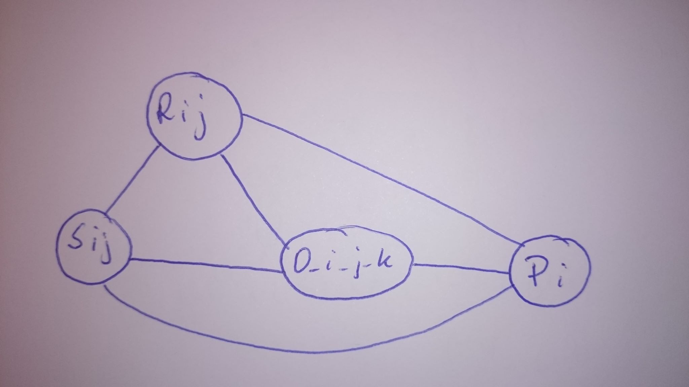

### Operacje elementarne:
1) Sij = Zamiana miejscami rzedu i z j w przypadku gdy na przekątnej jest 0
2) Rij = Wyznaczenie do współczynnika dla rzedu i oraz j
3) O_i_j_k = Dodanie komorki i z rzedu i do komorki i w rzedzie j pomnozonej o skalar k
4) Pi = Podzielenie rzedu i przez skalar znajdujacy sie na jego przekatnej

### Ciagi zadan obliczeniowych
```
Macierz wynikow dodaj jako osobna kolumne na koniec macierzy danych

Dla kazdego wiersza:
    Sprawdz czy na jego przekatnej nie jest 0:
        Jesli tak to zamien go z wyzszym/nizszym ktory nie ma
    Wyznacz wspolczynniki tak aby ponizej jego elementu i,i znajdowaly sie 0
    Dla kazdego wiersza ponizej:
        Dla kazdej komorki tego wiersza:
            dodaj wartosc wyznaczonego skalara przemnozona przez odpowiedni element aktualnego wiersza

Dla kazdego wiersza:
    podziel jego wartosc przez skalar znajdujacy sie na przekatnej
```
### Zaleznosci

```
D = {
    (Sij, O_i_j_k), (Sij, O_j_i_k), (Sij, Pi), (Sij, Pj), 
    (Rij, Sij), (Rij, O_i_j_k), (Rij, O_j_i_k), (Rij, Pi), (Rij, Pj), 
    (O_i_j_k, Pi), (O_i_j_k, Pj)
    }
```
### Slowa z jezyka
{(Sij^n Rab^N O_a_b_c^N^2)^N Pi^N | n = 0 lub 1}

### Klasy Foaty
[Rij][Sij][O_i_j_k][Pi]

### Graf


